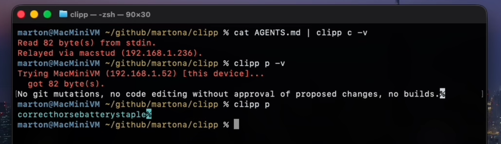

# Clipp

[](https://github.com/martona/clipp/actions/workflows/windows-ci.yml)
[](https://github.com/martona/clipp/actions/workflows/macos-ci.yml)
[](https://github.com/martona/clipp/actions/workflows/ios-ci.yml)
[](https://github.com/martona/clipp/actions/workflows/linux-ci.yml)

Cross-platform clipboard sync for trusted devices.

Clipp is a free, open source, peer-to-peer clipboard sync utility for Windows, macOS, and iOS, with a terminal-only client for Linux. It is built for devices you trust, on a network you control, sharing clipboard text and images without routing your clipboard through the cloud. Having said that, security (mutual authentication and encryption) is [not an afterthought](docs/SECURITY-MODEL.md). The terminal is a first-class citizen and in addition to a GUI, Clipp also supports `clipp copy` and `clipp paste` - think `pbcopy` but network-enabled.

I wrote Clipp because I needed this exact thing, and the usual options kept failing one or more basic tests: not open source, cloud-dependent, not free, or folded into a larger kitchen-sink app whose job was no longer just clipboard sync. Clipp tries to stay lean: discover nearby peers, verify device trust, move clipboard data directly, and otherwise stay out of the way.

Clipp is LAN-only by design. If you want the same workflow across networks, use an overlay such as Tailscale or NostrVPN and let Clipp keep doing the simple peer-to-peer part.

## Screenshots

<table>
  <tr>
    <td align="center" valign="top" width="50%">
      
    </td>
    <td align="center" valign="top" width="50%">
      
    </td>
  </tr>
  <tr>
    <td align="center" valign="top" colspan="2" width="100%">
      
    </td>
  </tr>
</table>

## What It Does

Clipp moves clipboard history between your own devices without a cloud service in the middle.

- Syncs clipboard text and images across Windows, macOS, and iOS, with a terminal-only client for Linux.
- Discovers peers on the local network automatically.
- Sends clipboard data directly between devices.
- Shows recent clipboard activity so you can copy an earlier item again.
- Works over trusted VPN or mesh networks when you want the same setup away from your LAN.
- Pipes clipboard text to and from the network from the command line (`clipp copy` / `clipp paste`), including over SSH.

## Security Model

Devices join with a shared network name + secret; Clipp derives a master key and shows a non-secret fingerprint so you can confirm two devices match. Connections are mutually authenticated from that key, then each session negotiates fresh ephemeral Diffie-Hellman keys for encryption - all built on libsodium primitives, no homegrown crypto. Clipboard data moves directly between peers over the LAN, never through a cloud service.

Clipp's trust model is deliberately narrow - your own devices, on a network or VPN you already trust - and it does not defend against software that can already read your local clipboard, a weak or mishandled secret, or a device you shouldn't have trusted. The full trust model, key hierarchy, transport details, and caveats live in the [Security Model](docs/SECURITY-MODEL.md); to report a vulnerability, see [SECURITY.md](SECURITY.md).

## Platform Status

| Platform | Architectures   | Minimum version | Notes                                                                |
|----------|-----------------|-----------------|----------------------------------------------------------------------|
| Windows  | amd64, arm64    | Windows 10 1809 | Native builds for both architectures.                                |
| macOS    | Apple Silicon   | macOS 14*       | Intel Macs are not supported.                                        |
| iOS      | arm64           | iOS 17          | No App Store / TestFlight builds yet — install from Xcode for now.   |
| Linux    | amd64, arm64    | glibc 2.31†     | Terminal client only (`clipp copy`/`paste`); no GUI, no tray.        |

\* The 14 floor is arbitrary; I just don't have older Macs or Intel hardware to test on. PRs to lower the minimum are welcome.

† glibc 2.31 (2021) covers Debian 11+, Ubuntu 20.04+, Fedora 33+, RHEL 9+, and current Arch/openSUSE. Requires `avahi-daemon` at runtime for peer discovery. The Linux client is headless by design — it has no clipboard-reading GUI; `clipp copy` reads stdin and sends it to the network, while `clipp paste` reads the network and writes stdout. It joins the same network and relays through your GUI devices.

## Installation

Direct download links below always point at the **latest published release** — no need to hunt through the [releases page](https://github.com/martona/clipp/releases/latest). (The version isn't in the filename; it's in `clipp --version` and, for Linux, the package metadata.)

| Platform | amd64 / x86_64 | arm64 |
|----------|----------------|-------|
| Windows (portable zip) | [clipp-windows-amd64.zip][win-amd64-zip] | [clipp-windows-arm64.zip][win-arm64-zip] |
| Windows (MSIX installer) | [clipp-windows-amd64.msix][win-amd64-msix] | [clipp-windows-arm64.msix][win-arm64-msix] |
| macOS (Apple Silicon) | — | [clipp-macos-arm64.zip][mac-arm64-zip] |
| Linux (.deb) | [clipp-linux-amd64.deb][lin-amd64-deb] | [clipp-linux-arm64.deb][lin-arm64-deb] |
| Linux (.rpm) | [clipp-linux-amd64.rpm][lin-amd64-rpm] | [clipp-linux-arm64.rpm][lin-arm64-rpm] |
| Linux (Arch) | [clipp-linux-amd64.pkg.tar.zst][lin-amd64-pkg] | [clipp-linux-arm64.pkg.tar.zst][lin-arm64-pkg] |
| Linux (raw binary) | [clipp-linux-amd64][lin-amd64-bin] | [clipp-linux-arm64][lin-arm64-bin] |

[win-amd64-zip]: https://github.com/martona/clipp/releases/latest/download/clipp-windows-amd64.zip
[win-arm64-zip]: https://github.com/martona/clipp/releases/latest/download/clipp-windows-arm64.zip
[win-amd64-msix]: https://github.com/martona/clipp/releases/latest/download/clipp-windows-amd64.msix
[win-arm64-msix]: https://github.com/martona/clipp/releases/latest/download/clipp-windows-arm64.msix
[mac-arm64-zip]: https://github.com/martona/clipp/releases/latest/download/clipp-macos-arm64.zip
[lin-amd64-deb]: https://github.com/martona/clipp/releases/latest/download/clipp-linux-amd64.deb
[lin-arm64-deb]: https://github.com/martona/clipp/releases/latest/download/clipp-linux-arm64.deb
[lin-amd64-rpm]: https://github.com/martona/clipp/releases/latest/download/clipp-linux-amd64.rpm
[lin-arm64-rpm]: https://github.com/martona/clipp/releases/latest/download/clipp-linux-arm64.rpm
[lin-amd64-pkg]: https://github.com/martona/clipp/releases/latest/download/clipp-linux-amd64.pkg.tar.zst
[lin-arm64-pkg]: https://github.com/martona/clipp/releases/latest/download/clipp-linux-arm64.pkg.tar.zst
[lin-amd64-bin]: https://github.com/martona/clipp/releases/latest/download/clipp-linux-amd64
[lin-arm64-bin]: https://github.com/martona/clipp/releases/latest/download/clipp-linux-arm64

### Windows

Download the portable zip ([amd64][win-amd64-zip] / [arm64][win-arm64-zip]), extract it anywhere, and run `clipp.exe`. Alternatively, there's an MSIX installer ([amd64][win-amd64-msix] / [arm64][win-arm64-msix]) if you prefer. The app writes to HKCU\Software\Clipp under the registry, and registers itself to auto-start with Windows, but otherwise leaves your system alone. To undo the latter (and stop Clipp from automatically starting), just use the Exit option in either the tray menu or the main app window. `clipp copy` and `clipp paste` work from the terminal as long as you have Clipp on the path. The app uses a .com shim to enable console operation.

### macOS

Download the [Apple Silicon zip][mac-arm64-zip], open it, and drag `Clipp.app` to `/Applications` then doubleclick to open. Clipp registers itself as a macOS background item so it can start with the system: use the Exit option in either the main app window or the menu bar menu to undo this. To use `clipp copy` / `paste` you probably want the app's binary (`/Applications/clipp.app/Contents/MacOS/clipp`) on your PATH.

### iOS

iOS distribution is not yet set up. Until TestFlight or App Store builds are published, the only way to install on a physical device is to build from source via Xcode (see [BUILDING.md](BUILDING.md#ios-device)).

### Linux

The Linux client is terminal-only (`clipp copy` / `clipp paste`) — there is no GUI. Grab the package for your distro from the table above (or `curl -LO` the link), then install it with your package manager — not the raw `dpkg`/`rpm` tools — so the Avahi dependency is pulled in automatically. Replace `<arch>` with `amd64` or `arm64`:

```sh
# Debian / Ubuntu
sudo apt install ./clipp-linux-<arch>.deb

# Fedora / RHEL / openSUSE
sudo dnf install ./clipp-linux-<arch>.rpm      # Fedora/RHEL
sudo zypper install ./clipp-linux-<arch>.rpm   # openSUSE

# Arch
sudo pacman -U ./clipp-linux-<arch>.pkg.tar.zst
```

The package installs `clipp` to `/usr/bin` and pulls in `libavahi-client`; it *recommends* `avahi-daemon`, which `apt`/`dnf` install by default (discovery needs it running). If you used `dpkg -i` / `rpm -i` on the downloaded file directly, those don't process recommends — enable the daemon yourself: `sudo systemctl enable --now avahi-daemon`. A raw static binary ([amd64][lin-amd64-bin] / [arm64][lin-arm64-bin]) is also published for distros without a matching package; `chmod +x` it and drop it anywhere on your `PATH`.

Set up the network from the terminal with `clipp key set` (it prompts for the network name and secret, exactly like the GUI's Network tab), then `clipp copy` / `clipp paste`. See [Command line](#command-line) below. Note that with no GUI, the Linux client relies on at least one desktop peer being reachable on the network to relay through.

### Verifying downloads

Every release artifact — the Windows/macOS zips and the Linux packages alike — is attested via Sigstore. You can confirm it's the unmodified output of this repo's [release workflow](.github/workflows/_release.yml) before running anything:

```sh
gh attestation verify clipp-windows-amd64.zip --repo martona/clipp     # Windows / macOS zips
gh attestation verify clipp-linux-amd64.deb --repo martona/clipp       # or .rpm / .pkg.tar.zst / the raw binary
```

Requires the [GitHub CLI](https://cli.github.com/). The verification ties the artifact's SHA256 to the exact CI run that built it, on the exact commit. Tampering anywhere in the chain - replaced upload, swapped artifact, modified contents - makes verification fail. (Linux packages are not GPG-signed; this attestation is the integrity mechanism, so `apt`/`zypper` may note the package is unsigned — expected for direct downloads.)

Windows binaries inside the zip are additionally Authenticode-signed via Microsoft Trusted Signing, which you can inspect via Properties -> Digital Signatures or:

```powershell
Get-AuthenticodeSignature .\clipp.exe
```

macOS bundles are Developer ID-signed and notarized by Apple, with the notarization ticket stapled into the `.app`. To inspect:

```sh
spctl --assess --type execute --verbose Clipp.app
stapler validate Clipp.app
codesign -dvvv Clipp.app
```

## Usage

### First run

When you launch Clipp on a new device, open the **Network** tab and choose:

- A **network name** — a label for your set of devices. Not a secret, but should be entered in exactly the same way on all your devices.
- A **secret** — the shared password that makes one of your devices indistinguishable from another to Clipp. Treat this with the care you'd give any password.

Clipp derives a master key from those two inputs and shows a fingerprint. Repeat the setup on every device you want to sync, using exactly the same name and secret. If the inputs match, the fingerprint matches and the devices will connect immediately; if a device shows a different fingerprint, one of the inputs is wrong on one device, and they won't sync until you fix it.

### Day-to-day

Once two or more devices show the same fingerprint, they discover each other on the local network within a few seconds and appear in the **Peers** list.

The simple flow: copy something (text or image) on device A, paste it on device B. You can ignore the UI entirely if that's all you need.

If you want more:

- The **Clipp** (activity) tab shows recent items received from every connected peer. Click any item to copy it back to your local clipboard.
- Text and images sync. Larger items take a moment. Copying files across devices is out of scope for the current release.
- The activity history lives in RAM only and is cleared when you quit. It's repopulated from the network when you open the app again.

Single-line text without whitespace is treated as a password and shown masked in the activity stream. The clipboard content itself isn't modified. iOS has a peek gesture to briefly reveal the text; the desktop apps don't have one yet.

### Tray and menu bar

- **Windows**: Clipp lives in the system tray. *Minimize to Tray* hides the window but keeps Clipp running (same as the window close button); *Exit Clipp* shuts it down entirely.
- **macOS**: Clipp lives in the menu bar. Same minimize/exit semantics as Windows.
- **iOS**: Clipp is a foreground app. Background clipboard sync is limited by iOS's restrictions on background clipboard and network access. A Share Extension puts Clipp in the iOS Share sheet — tap Share on any text or image and select Clipp to send it to your devices. Alternatively, open the app and tap *Send* to share whatever's on the clipboard right now, or tap any item in the activity stream to copy it back.

### Command line

On the desktop, the same binary doubles as a command-line tool, dispatching on its arguments — so moving the clipboard doesn't require the window in front of you, including over SSH. `clipp copy` reads stdin and sends it to your devices; `clipp paste` fetches the newest item and writes it to stdout. It's `pbcopy`/`pbpaste` for your Clipp network:

```sh
echo "deploy v2.1.0" | clipp copy    # push stdin to every device
clipp paste                          # print the newest network clipboard item
clipp p > notes.txt                  # `p` aliases paste; `c` aliases copy
```

Transfers are text-only and add no trailing newline, so they pipe cleanly. Delivery goes through whatever peers are already running on the network, so the desktop app doesn't need to be open on *this* machine — just reachable somewhere. You can also set a device's network name and secret from the terminal with `clipp key set`; run `clipp --help` for the rest (`key`, `hostid`).

On Windows, pipe through `clipp.com` (the console shim from [Installation](#windows)) — `clipp.exe` is the GUI and carries no stdio. On macOS the binary lives inside the bundle at `Clipp.app/Contents/MacOS/clipp`, if it's not on your `PATH`.

A note on macOS and using Clipp via SSH on a Mac host: Apps in an SSH session are blind to the keychain. Using Clipp this way requires you to have the GUI app running on the same machine so the process in the SSH session can query it for the network key.

## Troubleshooting

This section covers runtime issues. For build problems, see [BUILDING.md's troubleshooting section](BUILDING.md#troubleshooting).

**Devices don't see each other.** Clipp discovers peers via mDNS / DNS-SD. Common blockers: the devices are on different VLANs or guest networks that don't forward multicast, the access point has multicast filtering enabled, or a firewall on either device is blocking incoming UDP/TCP. On Windows, allow `clipp.exe` through the firewall on the *Private* network profile. On macOS, allow incoming connections for `Clipp.app` in System Settings -> Network -> Firewall. macOS prompts for this on first run; you only need to add the rule manually if you denied the prompt or have a stricter firewall policy in place.

**Linux: `Could not reach any device`, or no peers found.** One or more GUI peers need to be running on your network for CLI Clipp to work. In addition, Clipp needs the Avahi daemon running *and* mDNS allowed through the firewall:

```sh
# 1. Avahi must be running (the .deb/.rpm Recommends it, but `dpkg -i` / `rpm -i`
#    of a downloaded file does NOT pull Recommends — only apt/dnf do):
sudo systemctl enable --now avahi-daemon

# 2. On firewalld distros (Fedora, RHEL, openSUSE), open mDNS permanently.
sudo firewall-cmd --permanent --add-service=mdns
sudo firewall-cmd --reload
sudo firewall-cmd --list-services      # confirm 'mdns' is listed

# 3. Confirm Avahi itself can see Clipp peers (independent of Clipp). With a Clipp
#    GUI peer running elsewhere on the LAN, this should list a clipp-XXXXXXXX entry:
avahi-browse -rt _clipp._tcp
```

If `avahi-browse` shows nothing while another device's Clipp GUI is up, the problem is below Clipp (firewall, daemon, or multicast not reaching this host) — Clipp can only resolve what Avahi surfaces.

**Fingerprints don't match between devices.** The two devices have different inputs. Most often this is whitespace, case, or autocorrect on the network name or secret — the inputs are compared byte-for-byte. Re-enter both on the device with the mismatched fingerprint, being careful with mobile autocomplete and spell-correct.

**Clipboard sync works one direction but not the other.** Almost always a firewall issue on the device that *receives* but doesn't *send*. Connections are established outbound from sender to receiver; if the receiver's firewall blocks the inbound TCP connection, the link is broken. Check both devices' firewall settings.

**Windows: clipp doesn't appear in the system tray.** Windows hides tray icons by default. Click the ^ arrow next to the clock and drag the Clipp icon out of the overflow area to keep it visible.

**macOS: Gatekeeper warning on first launch of a self-built binary.** Right-click the app and choose *Open* once for unsigned local builds. Notarized release builds don't trigger this.

## Fervently Anticipated Questions

**Does Linux have a GUI? What about Android?**

Linux ships as a **terminal-only** client — `clipp copy` / `clipp paste` — with no GUI, tray, or local-clipboard reading. That's a deliberate fit for the place a headless Clipp is most useful: servers, containers, and SSH sessions, where it joins the encrypted network and relays clipboard text through your desktop/mobile peers. A full Linux *desktop* GUI isn't planned — clipboard semantics vary widely across X11/Wayland and desktop environments, which is a much larger investment than the headless client was. Android isn't in scope either (it isn't in my life). If you have a strong use case for either, open an issue.

**Can I sync over the internet without a VPN?**

No, and that's intentional. Clipp discovers peers via local multicast and isn't designed to be exposed directly to the internet. To use it between devices on different networks, put them on a mesh or overlay network you trust (Tailscale, ZeroTier, NostrVPN, WireGuard, etc.) — multicast works on most of those, and Clipp's discovery picks up as usual.

**Does Clipp upload anything to a server?**

No. There is no telemetry, no analytics, no crash reporting. Clipp's only network traffic is local discovery and direct peer-to-peer transfers between your own devices.

**I forgot the network secret. Can I recover it?**

No. The secret is part of the key — there's no recovery channel. If you forget it, set up a fresh network with a new name and secret on every device. The fingerprint will change; that's expected.

## Building From Source

See [BUILDING.md](BUILDING.md) for prerequisites and build instructions for Windows, macOS, and iOS.

## Project Status

Clipp is currently **early-stage public preview**: it works for the cases I use day-to-day, but it's not a finished product. Specifically:

- The wire protocol is subject to breaking changes.
- iOS distribution (TestFlight / App Store) is not yet set up; iOS users currently need Xcode to install on a device.
- Bug reports are welcome, but expect a single-maintainer response time.

Clipp is actively developed.

## Contributing

Issues and pull requests are welcome. A few ground rules:

- **Issues** should include the platform, the version (or commit), and a clear reproduction. Vague reports get vague responses.
- **PRs** should be focused — one logical change per PR. Big bundles of unrelated changes are hard to review and slow to land.
- **CI must pass.** Build failures are not someone else's problem to investigate.
- **Match the surrounding code style.** No formatter is enforced, but inconsistent style will be flagged in review.
- **AI policy.** I don't care as long as the code reviews well.

If you're not sure whether a change is welcome, open an issue first to discuss the approach before sinking time into a PR.

For setup and build instructions, see [BUILDING.md](BUILDING.md).

## License

Clipp is released under the MIT License. See [LICENSE.md](LICENSE.md).
