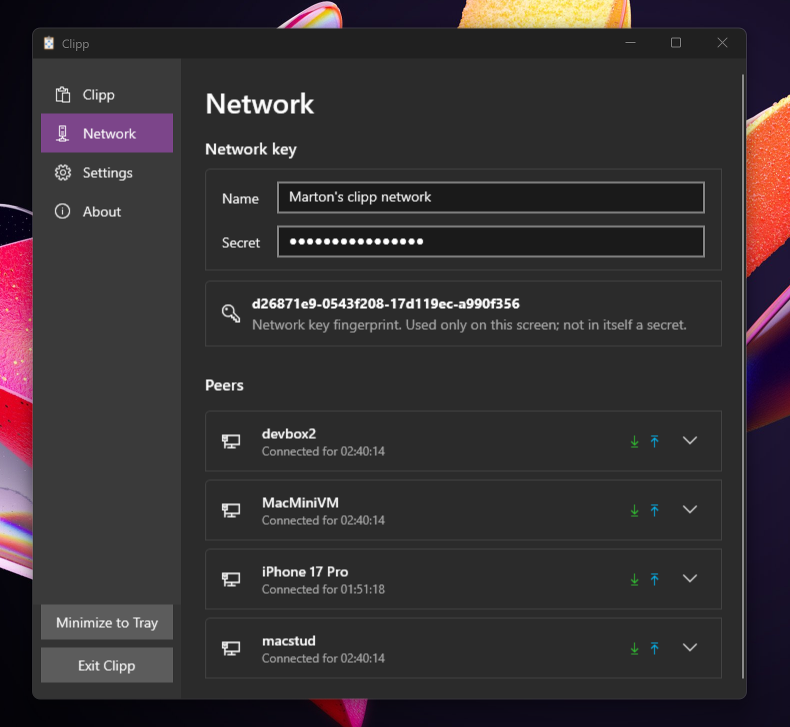
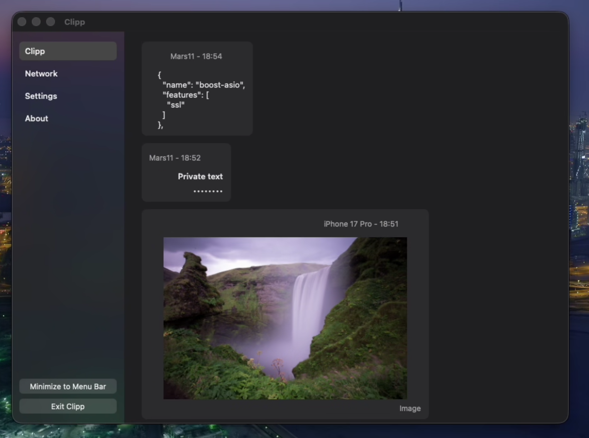

# Clipp

[](https://github.com/martona/clipp/actions/workflows/windows-ci.yml)
[](https://github.com/martona/clipp/actions/workflows/macos-ci.yml)
[](https://github.com/martona/clipp/actions/workflows/ios-ci.yml)

Secure cross-platform clipboard sync for trusted devices.

Clipp is a free, open source, peer-to-peer clipboard sync utility for Windows, macOS, and iOS. It is built for the boring case: devices you already trust, on a network you already control, sharing clipboard text and images without routing your clipboard through someone else's cloud.

I wrote Clipp because I needed this exact thing, and the usual options kept failing one or more basic tests: not open source, cloud-dependent, not free, or folded into a larger kitchen-sink app whose job was no longer just clipboard sync. Clipp tries to stay narrow: discover nearby peers, verify device trust, move clipboard data directly, and otherwise stay out of the way.

Clipp is LAN-first by design. If you want the same workflow across networks, use an overlay such as Tailscale or NostrVPN and let Clipp keep doing the simple peer-to-peer part.

## Screenshots

<table>
  <tr>
    <td align="center" valign="top">
      <br>
      <em>Windows — peer discovery, with key fingerprint and connected devices</em>
    </td>
    <td align="center" valign="top">
      <br>
      <em>macOS — clipboard activity stream: text, masked password, image from iPhone</em>
    </td>
  </tr>
</table>

## What It Does

Clipp moves clipboard history between your own devices without a cloud service in the middle.

- Syncs clipboard text and images across Windows, macOS, and iOS.
- Discovers peers on the local network automatically.
- Sends clipboard data directly between devices.
- Shows recent clipboard activity so you can copy an earlier item again.
- Works over trusted VPN or mesh networks when you want the same setup away from your LAN.

## Security Model

Clipp is designed for a specific trust model: your own devices, on a network or VPN you already trust. It is not meant to be an open pairing protocol for strangers on the same Wi-Fi, and it is not a cloud account system with remote device management.

Devices join a Clipp network by using the same network name and secret. Clipp derives a master key from that input, stores it in platform-protected storage, and shows a fingerprint so you can verify that devices are configured with the same key. The fingerprint is not a secret; it is just a way to detect mismatched setup. Discovery, handshakes, fingerprints, and encrypted streams use separate keys derived from that master key.

Local discovery is encrypted and authenticated. Devices that do not know the key should not be able to read or produce valid discovery packets; they should just see opaque multicast traffic.

Clipboard transfers are sent directly between peers over TCP. The connection handshake is authenticated with keys derived from the master key, then each connection uses fresh ephemeral Diffie-Hellman session keys for encrypted clipboard messages. Clipp uses libsodium primitives for this rather than trying to invent its own cryptography.

Clipboard data is still clipboard data. If a trusted device receives it, that device can read it. If malware, remote desktop software, another clipboard manager, or the operating system can read your local clipboard, Clipp cannot prevent that. Clipp also does not protect you from choosing a weak shared secret, sharing the secret with the wrong person, or running it on a device you do not actually trust.

On-device state is local to the device. The master key is stored through the OS key store. Recent clipboard activity is retained in memory only and not persisted to disk. Treat every configured device as part of the same trust boundary.

A note on passwords on the clipboard: single-line text that does not contain whitespace is assumed to be a password and is masked in the activity stream. This gives you safety from prying eyes, but is not a serious security boundary. Chrome, password managers, and others set a clipboard marker asking other apps to exclude the item from any kind of clipboard history — local managers and cloud sync alike. Clipp currently ignores that marker, which means passwords copied from these apps do end up in the activity stream (masked, but present). Honoring the marker is on the list; a Settings toggle to choose between honor / ignore is the likely shape.

Clipp is LAN-first. If you want to use it across networks, put the devices on a trusted VPN or mesh network and keep the Clipp listener off the public internet. The master key is still required, but the intended outer boundary is a private network you control.

To report a vulnerability, see [SECURITY.md](SECURITY.md).

## Platform Status

| Platform | Architectures   | Minimum version | Notes                                                                |
|----------|-----------------|-----------------|----------------------------------------------------------------------|
| Windows  | amd64, arm64    | Windows 10 1809 | Native builds for both architectures.                                |
| macOS    | Apple Silicon   | macOS 14*       | Intel Macs are not supported.                                        |
| iOS      | arm64           | iOS 17          | No App Store / TestFlight builds yet — install from Xcode for now.   |

\* The 14 floor is arbitrary; I just don't have older Macs or Intel hardware to test on. PRs to lower the minimum are welcome.

## Installation

### Windows

Download the zip for your architecture from the [latest release](https://github.com/martona/clipp/releases/latest), extract it anywhere, and run `clipp.exe`. The app writes to HKCU\Software\Clipp under the registry, and registers itself to auto-start with Windows, but otherwise leaves your system alone. To undo the latter (and stop Clipp from automatically starting), just use the Exit option in either the tray menu or the main app window. Launch via `clipp.com` instead of `clipp.exe` if you want clipp's stdout attached when starting from `cmd` or PowerShell — useful for debugging, but most users won't need it.

### macOS

Download the disk image or zip for Apple Silicon from the [latest release](https://github.com/martona/clipp/releases/latest), open it, and drag `Clipp.app` to `/Applications`. macOS will confirm opening an app from an identified developer on first launch — click *Open*. Clipp registers itself as a macOS background item so it can start with the system: use the Exit option in either the main app window or the menu bar menu to undo this.

### iOS

iOS distribution is not yet set up. Until TestFlight or App Store builds are published, the only way to install on a physical device is to build from source via Xcode (see [BUILDING.md](BUILDING.md#ios-device)).

### Verifying downloads

Every release zip is attested via Sigstore — you can confirm it's the unmodified output of this repo's [release workflow](.github/workflows/_release.yml) before running anything:

```sh
gh attestation verify clipp-<version>-<os>-<arch>.zip --repo martona/clipp
```

Requires the [GitHub CLI](https://cli.github.com/). The verification ties the zip's SHA256 to the exact CI run that built it, on the exact commit. Tampering anywhere in the chain — replaced upload, swapped artifact, modified zip contents — makes verification fail.

Windows binaries inside the zip are additionally Authenticode-signed via Microsoft Trusted Signing, which you can inspect via Properties → Digital Signatures or:

```powershell
Get-AuthenticodeSignature .\clipp.exe
```

macOS bundles are Developer ID-signed and notarized by Apple, with the notarization ticket stapled into the `.app`. Gatekeeper validates this offline on first launch, so no warning dialog appears. To inspect:

```sh
spctl --assess --type execute --verbose Clipp.app
stapler validate Clipp.app
codesign -dvvv Clipp.app
```

## Usage

### First run

When you launch Clipp on a new device, open the **Network** tab and choose:

- A **network name** — a label for your set of trusted devices. Not a secret, but should be specific enough that you'd notice a typo.
- A **secret** — the shared password that makes one of your devices indistinguishable from another to Clipp. Treat this with the care you'd give any password.

Clipp derives a master key from those two inputs and shows a fingerprint. Repeat the setup on every device you want to sync, using exactly the same name and secret. If the inputs match, the fingerprint matches and the devices will connect immediately; if a device shows a different fingerprint, one of the inputs is wrong on at least one device, and the devices won't sync until you fix it.

### Day-to-day

Once two or more devices show the same fingerprint, they discover each other on the local network within a few seconds and appear in the **Peers** list.

The simple flow: copy something (text or image) on device A, paste it on device B. You can ignore the UI entirely if that's all you need.

If you want more:

- The **Clipp** (activity) tab shows recent items received from every connected peer. Click any item to copy it back to your local clipboard.
- Text and images sync. Larger items take a moment. Copying files across devices is out of scope for the current release.
- The activity history lives in RAM only and is cleared when you quit.

Single-line text without whitespace is treated as a password and shown masked in the activity stream. The clipboard content itself isn't modified. iOS has a peek gesture to briefly reveal the text; the desktop apps don't have one yet.

### Tray and menu bar

- **Windows**: Clipp lives in the system tray. *Minimize to Tray* hides the window but keeps clipp running; *Exit Clipp* shuts it down entirely.
- **macOS**: Clipp lives in the menu bar. Same minimize/exit semantics as Windows.
- **iOS**: Clipp is a foreground app. Background clipboard sync is limited by iOS's restrictions on background clipboard and network access. A Share Extension puts Clipp in the iOS Share sheet — tap Share on any text or image and select Clipp to send it to your devices. Alternatively, open the app and tap *Send* to share whatever's on the clipboard right now, or tap any item in the activity stream to copy it back.

## Troubleshooting

This section covers runtime issues. For build problems, see [BUILDING.md's troubleshooting section](BUILDING.md#troubleshooting).

**Devices don't see each other.** Clipp discovers peers via mDNS / DNS-SD. Common blockers: the devices are on different VLANs or guest networks that don't forward multicast, the access point has multicast filtering enabled, or a firewall on either device is blocking incoming UDP/TCP. On Windows, allow `clipp.exe` through the firewall on the *Private* network profile. On macOS, allow incoming connections for `Clipp.app` in System Settings → Network → Firewall. macOS prompts for this on first run; you only need to add the rule manually if you denied the prompt or have a stricter firewall policy in place.

**Fingerprints don't match between devices.** The two devices have different inputs. Most often this is whitespace, case, or autocorrect on the network name or secret — the inputs are compared byte-for-byte. Re-enter both on the device with the mismatched fingerprint, being careful with mobile autocomplete and spell-correct.

**Clipboard sync works one direction but not the other.** Almost always a firewall issue on the device that *receives* but doesn't *send*. Connections are established outbound from sender to receiver; if the receiver's firewall blocks the inbound TCP connection, the link is broken. Check both devices' firewall settings.

**Windows: clipp doesn't appear in the system tray.** Windows hides tray icons by default. Click the ^ arrow next to the clock and drag the Clipp icon out of the overflow area to keep it visible.

**macOS: Gatekeeper warning on first launch of a self-built binary.** Right-click the app and choose *Open* once for unsigned local builds. Notarized release builds don't trigger this.

## Fervently Anticipated Questions

**Will Clipp ever support Linux or Android?**

Linux and Android aren't currently in scope. Clipp uses platform-specific clipboard APIs (Win32, AppKit, UIKit) and OS-protected key storage, and adding either platform is a meaningful engineering investment rather than a small port — Linux clipboard semantics in particular vary widely across desktop environments. If you have a strong use case, open an issue describing it. I'd like to do it eventually but Android isn't in my life, nor is a permanent Linux desktop.

**Can I sync over the internet without a VPN?**

No, and that's intentional. Clipp discovers peers via local multicast and isn't designed to be exposed directly to the internet. To use it between devices on different networks, put them on a mesh or overlay network you trust (Tailscale, ZeroTier, NostrVPN, WireGuard, etc.) — multicast works on most of those, and Clipp's discovery picks up as usual.

**Does Clipp upload anything to a server?**

No. There is no telemetry, no analytics, no crash reporting. Clipp's only network traffic is local discovery and direct peer-to-peer transfers between your own devices.

**I forgot the network secret. Can I recover it?**

No. The secret is part of the key — there's no recovery channel. If you forget it, set up a fresh network with a new name and secret on every device. The fingerprint will change; that's expected.

## Building From Source

See [BUILDING.md](BUILDING.md) for prerequisites and build instructions for Windows, macOS, and iOS.

## Project Status

Clipp is currently **early-stage public preview**: it works for the cases I use day-to-day, but it's not a finished product. Specifically:

- The wire protocol is subject to breaking changes.
- iOS distribution (TestFlight / App Store) is not yet set up; iOS users currently need Xcode to install on a device.
- Bug reports are welcome, but expect a single-maintainer response time.

Clipp is actively developed.

## Contributing

Issues and pull requests are welcome. A few ground rules:

- **Issues** should include the platform, the version (or commit), and a clear reproduction. Vague reports get vague responses.
- **PRs** should be focused — one logical change per PR. Big bundles of unrelated changes are hard to review and slow to land.
- **CI must pass.** Build failures are not someone else's problem to investigate.
- **Match the surrounding code style.** No formatter is enforced, but inconsistent style will be flagged in review.
- **AI policy.** I don't care as long as the code reviews well.

If you're not sure whether a change is welcome, open an issue first to discuss the approach before sinking time into a PR.

For setup and build instructions, see [BUILDING.md](BUILDING.md).

## License

Clipp is released under the MIT License. See [LICENSE.md](LICENSE.md).
